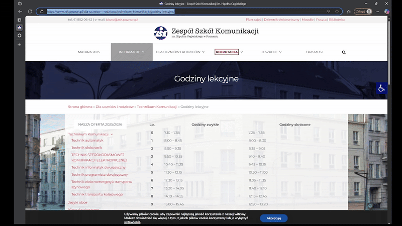

# TinyLink
TinyLink is a simple URL shortener service using Django and Django Rest Framework.
It allows generating short (tiny) links to manage long URLs efficiently
(in development)


## Technologies used

- Python 3.9.21

- Django 4.2.20

- MySQL

## Installation
(make sure pip is installed before running the script)
```
source ./setup.sh
```


## Features

- Generate short (tiny) URLs from long ones

- Redirect to the original URL using the short code

- View all stored links, including date of last usage

- Delete old links based on a time threshold

- Show the configuration of the shortening service
## API Reference

#### Create new short code

```http
  POST /api/v1.0/short/
```

| Argument | Type     
| :-------- | :------- 
| `long_link` | `URL`

#### Get link by code

```http
  GET /api/v1.0/short/${code}/
```

#### Get code by link

```http
  GET /api/v1.0/code/${long_link}/
```

#### Get all links

```http
  GET /api/v1.0/all/
```

#### Get server configuration

```http
  GET /api/v1.0/config/
```
#### Delete records by threshold
```http
  DELETE /api/v1.0/delete/{days}
```
(for now days are fixed at 30 and providing argument won't affect it)
## A quick demo


## Testing
- to run tests use
```
python manage.py test
```
- to run with code coverage use
```
coverage run --source='.' manage.py test
```
#### To see the results of code coverage use any of the following
- to see results in terminal
```
coverage report
```
- to see results in html
```
coverage html
```

# Setup Guide

## Prerequisite
* Github
```
sudo yum install -y git
```
* Docker
```
sudo yum install -y yum-utils
sudo yum-config-manager --add-repo https://download.docker.com/linux/centos/docker-ce.repo
sudo yum install -y docker-ce
docker-ce-cli containerd.io
```
```
sudo systemctl enable --now docker
sudo curl -L "https://github.com/docker/compose/releases/latest/download/docker-compose-$(uname -s)-$(uname -m)" -o /usr/local/bin/docker-compose
sudo chmod +x /usr/local/bin/docker-compose

```
* Python
* if base dependencies not installed yet use
```
sudo dnf install -y \
    pkgconf \
    mariadb-connector-c-devel \
    openssl-devel \
    gcc \
    python3-devel
```
```
sudo dnf install -y openssh-server
```
```
sudo service sshd restart
```


## Clone 
* clone git repo using
```
git clone https://github.com/dfigat/TinyLink.git
```
## Requirements
* to install requirements go to TinyLink dir and run
```
source  scripts/setup.sh
```
## Generating SSL certificates
- using console navigate to Backend and use
[replace yourdomain.com with actual domain]
[replace /path/to/certs with path to actual certs]
```
bash scripts/issue-certificate.sh -d yourdomain.com -o /path/to/certs
```
## Database
* Activate mariadb database
```
sudo systemctl enable mariadb
sudo systemctl start mariadb
```

## Environment
- in `backend` directory user can find `env.example` file
### `env.example`
```
RESTART_POLICY=unless-stopped

DATABASE_IMAGE_TAG: mariadb:11.4

DATABASE_NAME="YourDatabaseName"
DATABASE_USER="YourDatabaseUser"
DATABASE_PASSWORD="YourDatabasePassword"
DATABASE_ROOT_PASSWORD="YourDatabaseRootPassword"
DATABASE_HOST="YourDatabaseHost"
DATABASE_PORT="YourDatabasePort"


TEST_DATABASE_NAME="YourTestDatabaseName"
TEST_DATABASE_USER="YourTestDatabaseUser"
TEST_DATABASE_PASSWORD="YourTestDatabasePassword"
TEST_DATABASE_HOST="YourTestDatabaseHost"
TEST_DATABASE_PORT="YourTestDatabasePort"

SECRET_KEY="YourVerySecretKey"

ALLOWED_HOST="YourAllowedHost"
ALLOWED_DOMAIN="YourDomain"

API_URL="YourApiUrl"
API_URL_SHORTENED="YourShortendApiUrl" #the one without'/api' at the end
```
* Change `YourDatabase[*]` to actual data(where [*] is the rest of the name)
* Change this file's name to `.env`
